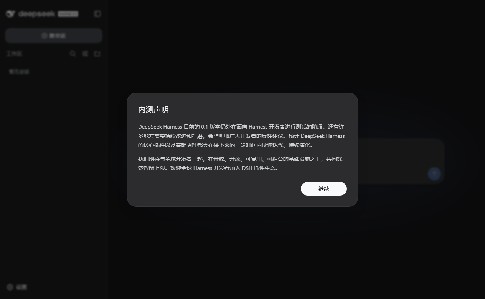

# DeepSeek Harness Portable

> Ship DeepSeek Harness as a portable, zero-install Windows desktop app — one ZIP, double-click, done.

**English** | [中文](README.zh.md)

[](https://github.com/maiziman/deepseek-harness-portable/actions)
[](https://github.com/maiziman/deepseek-harness-portable/releases)
[](LICENSE)
[](#compatibility)
[](https://github.com/maiziman/deepseek-harness-portable/releases)

<details>
<summary><b>Why does this exist?</b></summary>

[DeepSeek Harness](https://github.com/deepseek-ai/deepseek-harness) (`dsh`) is distributed through npm: the
official path requires Node.js 22.19+ on the target machine. If you want to hand the product to a
non-technical user — or run it on a machine where installing a Node toolchain is not an option —
this project builds **one self-contained ZIP** from the latest published `@deepseek-ai/dsh`:

- a bundled official Node.js runtime, so no Node is needed on the target PC
- a native desktop window (Electron-embedded UI), so double-clicking opens an **app**, not a browser tab
- all data inside the package, so the whole folder can be copied to a USB stick and moved between machines

</details>

## Quick start

1. Download `DeepSeek-Harness-win64-v<version>.zip` from the [latest release](https://github.com/maiziman/deepseek-harness-portable/releases)
2. Extract it (a short path like `C:\Tools\` works best)
3. Double-click `DeepSeek-Harness.exe` → a window opens instantly → accept the notice → add a DeepSeek API key in **Settings → Models** → pick a workspace and start chatting



## Features

| | |
|---|---|
| 🖥️ **Native desktop app** | Electron-embedded dsh UI (bundled Chromium, no system WebView2 dependency); the window appears instantly, then loads the real UI |
| 📦 **Zero environment** | Official Node.js runtime + all production dependencies (~458 packages incl. native `koffi` / `node-pty`) are inside the ZIP; no Node, npm, admin rights, or registry writes |
| 🧳 **Truly portable** | `dsh-home` keeps settings, sessions and plugins in-package; copy the folder anywhere, uninstall = delete it |
| 🔒 **Reproducible builds** | Pinned versions (dsh / Node / Electron), official SHA256 verification for Node, pnpm-locked dependencies, deterministic tree |
| 🧪 **Verification gate** | In-package smoke probe + GitHub Actions matrix (Windows Server 2022/2025 fresh runners) on every push; tags auto-publish Releases |

## How it works

```
build-portable.ps1
 ├─ 1. resolve versions (dsh = npm latest, Node pinned, Electron pinned)
 ├─ 2. Node runtime: official win-x64, SHA256-verified
 ├─ 3. pnpm production install (hoisted flat node_modules — no symlinks, ZIP-safe)
 ├─ 4. Electron shell: packager → DeepSeek-Harness.exe
 ├─ 5. assemble tree (runtime/ + app/ + dsh-home/ + README.txt + dsh.cmd)
 ├─ 6. smoke: boot the app headless, assert server URL + UI screenshot, exit 0
 └─ 7. zip + SHA256SUMS.txt        ← DeepSeek-Harness-win64-v<dsh>.zip
```

The desktop shell (`shell/main.js`) spawns `runtime\node.exe` running
`dsh web --no-open --port 0` (a free port is picked automatically), learns the URL from
the server's readiness line, and serves it in the window. Single-instance locking focuses
the existing window on a second launch; closing the window stops the whole server tree.

## Build from source

```powershell
# Prerequisites: Windows 10+, PowerShell 7 or Windows PowerShell 5.1, access to npm registry
.\build-portable.ps1
```

| Parameter | Meaning |
|---|---|
| `-DshVersion 0.1.1-rc.2` | dsh version; defaults to the npm latest |
| `-NodeVersion v24.19.0` | official Node version (must satisfy dsh engines `^22.19 \|\| >=24`) |
| `-ElectronVersion 44.0.0` | Electron version |
| `-ElectronMirror npmmirror` | Electron binary source: `npmmirror` (default, CN-friendly) / `github` (CI) / any mirror URL |
| `-SkipSmoke` | skip the in-package smoke; `-ForceDownloadNode` re-downloads Node with checksum check |

Output: `dist\DeepSeek-Harness-win64-v<sh>.zip` + `dist\SHA256SUMS.txt`; the package's `manifest.json`
records every version and the SHA256 of key binaries.

## Compatibility & verification

`verify-package.ps1` is the single compatibility probe — deterministic pass/fail, runnable anywhere:

```powershell
.\verify-package.ps1                  # probes the newest dist\ ZIP
.\verify-package.ps1 -ZipPath x.zip   # probe a specific package
```

It asserts: extraction completeness → manifest/Node version match → real boot
(server up, URL announced, UI rendered, screenshot captured, exit 0) → first-run
profile auto-initialization.

| Layer | Coverage | Cadence |
|---|---|---|
| In-build smoke | everything above, one machine | every build |
| GitHub Actions matrix (`windows-2022` + `windows-2025`, fresh machines) | builds + probes + artifacts | every push & `v*` tag |
| Real machines / Windows Sandbox | consumer Windows 10/11, AV, old hardware | one spot-check per release |

> GitHub runners are Server images; for the consumer Win10/11 final word, run the probe on
> one or two real machines (or Windows Sandbox) per release. Requirements: Windows 10 21H2+,
> x64; no admin rights; in rare stripped systems install the VC++ 2022 x64 runtime if the app
> refuses to start.

## FAQ

- **Windows SmartScreen warns on first launch?** → *More info → Run anyway.* The bundled
  `node.exe` is the officially signed Node.js binary; package checksums are in `manifest.json` and the Release SHA256SUMS.
- **Port already in use?** → the app picks a free port automatically; for a CLI run use `dsh.cmd web --port 8080`.
- **Where is my data?** → `dsh-home` next to the exe. Back up or relocate by copying the folder.
- **Can I use it from the command line?** → `dsh.cmd web`, `dsh.cmd --profile headless "task"`, etc.
- **Why is the first startup slower?** → first run initializes the profile and the symlink fallback and is scanned by AV; later starts are seconds.

## Project layout

```
.
├─ build-portable.ps1     main build (runtime/prepare/install/pack/assemble/smoke/zip)
├─ verify-package.ps1     compatibility probe (extract/versions/smoke/first-run)
├─ watch-progress.ps1     dev helper: one progress line every 20 s
├─ shell/                 Electron shell sources (main.js, icon generator)
├─ .github/workflows/     CI matrix + tag releases
├─ docs/                  README screenshot
└─ dist/ .build/ .cache/  generated (git-ignored; artifacts ship via Releases)
```

## Contributing

Issues and PRs are welcome. For a new release, bump the pinned defaults (or pass parameters),
run `.\build-portable.ps1` locally, and let CI verify the matrix before tagging `v*`.

## License & attribution

This repository is **MIT** licensed ([LICENSE](LICENSE)). It ships build tooling only — it does not
vendor DeepSeek Harness source. Built packages are assembled from:

- [DeepSeek Harness](https://github.com/deepseek-ai/deepseek-harness) (MIT, © DeepSeek AI)
- Node.js (MIT) · Electron (MIT) · all npm dependencies in `app\node_modules` under their own licenses (versions recorded in `manifest.json`)
