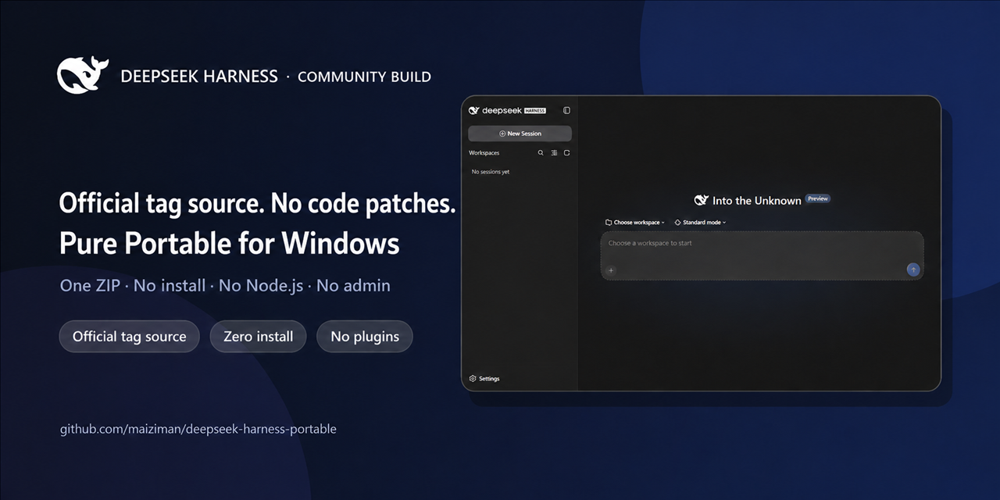
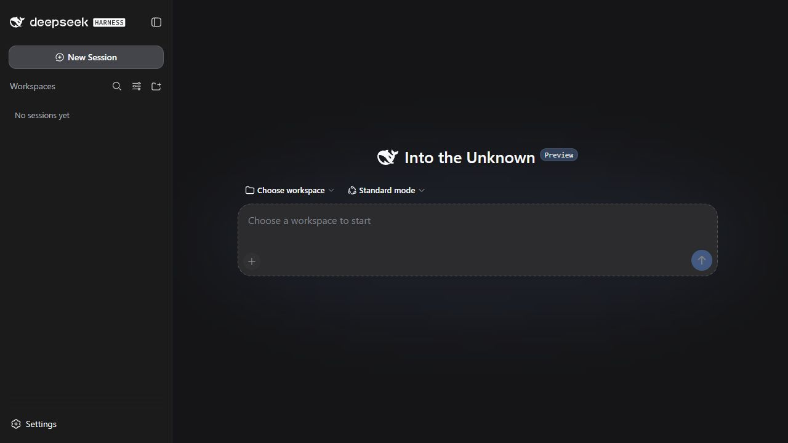

<h1 align="center">DeepSeek Harness 纯净便携桌面版</h1>

<p align="center"><strong>使用官方标签源码，不给上游源码打补丁，只增加 Windows 桌面与便携启动能力。</strong></p>

<p align="center">
  <a href="https://github.com/maiziman/deepseek-harness-portable/releases/latest"><strong>下载最新 ZIP</strong></a>
  · <a href="https://github.com/maiziman/deepseek-harness-portable/releases/tag/plugin-model-capabilities-v0.1.1"><strong>获取可选的自定义 API 插件</strong></a>
  · <a href="README.md">English</a>
</p>

<p align="center">
  <a href="https://github.com/maiziman/deepseek-harness-portable/actions"></a>
  <a href="https://github.com/maiziman/deepseek-harness-portable/releases"></a>
  <a href="LICENSE"></a>
  
  <a href="https://github.com/maiziman/deepseek-harness-portable/releases"></a>
</p>

| 可信依据 | 具体含义 |
|---|---|
| **上游保持原样** | 选定的官方 `dsh-v*` 标签不做源码修改，使用上游自己的 `release:verify`、`build:official` 和 `release:pack` 流程构建。 |
| **只增加 Windows 使用体验** | 本项目提供固定版本的 Node.js、pnpm 与 Electron 环境、独立窗口、便携数据目录和明确的更新提示。 |
| **没有隐藏的能力层** | 默认 ZIP 不内置、也不会自动安装任何能力插件；可选插件拥有独立安装包、校验和与 Release。 |

> [!IMPORTANT]
> 这是独立的社区便携打包项目，与 DeepSeek 无隶属、合作、赞助或官方授权关系，也不是官方发布渠道。“DeepSeek Harness”名称和鲸鱼 LOGO 仅用于标识所打包的上游软件，属于 DeepSeek 的商标与品牌资产。

<p align="center">
  
</p>

## 三步开始使用

1. 从 [Releases 页面](https://github.com/maiziman/deepseek-harness-portable/releases) 下载 `DeepSeek-Harness-win64-v<版本>.zip`，有预览版时也会列在这里。
2. 解压到较短的路径，例如 `C:\Tools\DeepSeek-Harness`。
3. 双击 `DeepSeek-Harness.exe`，确认预览版声明，按提示填写 DeepSeek API Key，选择工作区并新建会话。

无需 Node.js、安装程序或管理员权限。安装包不附带 API Key。社区构建的桌面壳尚未做代码签名，因此 Windows SmartScreen 可能提示“无法识别的应用”；请先核对 Release 校验和，再选择**更多信息 → 仍要运行**。

<p align="center">
  
</p>

## 便携程序增加了什么

| | 你会得到什么 |
|---|---|
| **零环境准备** | 已包含 Node.js 运行时、生产依赖，以及只供可选官方插件命令使用的固定哈希 pnpm；无需 WebView2、注册表修改或管理员权限。 |
| **独立桌面窗口** | Electron 壳在自己的窗口中打开上游 DeepSeek Harness，关闭窗口会同时停止本地服务。 |
| **便携数据** | 设置、会话、手动安装的插件和日志都在程序旁的 `dsh-home` 中；整个文件夹可一起移动和备份。 |
| **发布可验证** | Node.js 下载会与官方 SHA256 文件核对；manifest 记录精确组件与上游源码身份；每个 Release 都提供校验和。 |
| **全新系统验证** | 每次推送都在全新的 Windows Server 2022 和 2025 GitHub runner 上完成构建与真实启动。 |
| **自动跟进上游** | 每六小时检查最高的官方 `dsh-v*` 标签，使用上游发布流程构建该标签的精确提交，并在需要时公开下一个经过验证的便携版本；无需等待 npm 发布。 |
| **主动提示更新** | 程序每天最多检查一次已经公开的便携版 Release，先询问再打开经过验证的下载页面，不会静默替换文件。 |

### 便携 ZIP 还是官方 npm 安装？

| | 纯净便携 ZIP | 官方 npm 包 |
|---|---|---|
| 更适合 | 快速体验、非技术用户、移动硬盘/U 盘 | 开发者和统一管理 Node.js 的环境 |
| 准备工作 | 解压并双击 | 安装受支持的 Node.js 版本和 npm 包 |
| 更新方式 | 程序提示已公开的新版本；下载新 ZIP 并保留 `dsh-home` | 通过 npm 更新 |
| 运行时 | 已内置并固定版本 | 使用电脑上的 Node.js |
| 插件 | 默认不安装 | 本项目不会额外添加 |

## 可选：DSH 自定义 API 能力识别插件

[`DSH 自定义 API 能力识别插件`](plugins/dsh-model-capabilities/README.zh.md) 是面向 OpenAI-compatible 自定义模型的独立可选 Bundle。它会识别支持的思考等级与图像输入能力，保留用户明确设置的每个值，默认不对公网端点发起主动推理请求。

请从 [DSH 自定义 API 能力识别插件 v0.1.1 Release](https://github.com/maiziman/deepseek-harness-portable/releases/tag/plugin-model-capabilities-v0.1.1) 下载独立版本的安装包与校验和。安装或更新便携 ZIP 不会替你安装这个插件。

## 兼容性与验证

- **系统：** Windows 10 21H2 或更高版本、Windows 11，x64 架构。
- **权限：** 无需管理员权限；界面和服务只在本机运行。
- **上游输入：** 本地构建可使用已经发布的 `@deepseek-ai/dsh` 包；自动构建使用上游发布脚本从精确官方 Git 标签生成的完整包集合。
- **包内内容：** 经过验证的 DeepSeek Harness 生产目录、官方 Node.js 运行时、供明确管理插件时使用的固定哈希 pnpm、Electron 桌面壳、便携目录、声明文件与启动入口；不内置能力插件。
- **构建路径隐私：** 打包过程不修改上游可执行代码或运行配置；它先把构建工具生成的非执行源码分区注释与包管理器 shim 注释改成仓库相对形式，再扫描每个成品文件，确保真实仓库、runner、临时目录、包输入与用户主目录路径不会进入 ZIP。
- **验证方式：** 先用 `SHA256SUMS.txt` 核对 ZIP，再运行 `verify-package.ps1` 完成真实启动和 UI 渲染探测。
- **当前成熟度：** DeepSeek Harness 0.1 仍是面向 Harness 开发者的预览版，其界面、插件 API 和包结构可能快速变化。

完整的源码来源校验、构建输入、Windows 矩阵和发布方式见 [构建与验证](docs/BUILDING.zh.md)。

## 自行构建

```powershell
# Windows 10+、PowerShell 7.2 或更高版本，并可访问 npm registry
.\build-portable.ps1
```

不提供官方包目录时，命令会从已经发布的 npm 版本构建，并生成 `dist\DeepSeek-Harness-win64-v<便携版本>.zip` 与 `dist\SHA256SUMS.txt`。`manifest.json` 会分别记录便携版本和包内 dsh 版本，并在提供来源信息时记录精确的上游源码身份。

## 常见问题

<details>
<summary><strong>我的数据保存在哪里？</strong></summary>

可执行文件旁的 `dsh-home` 保存设置、会话、手动安装的插件和日志；备份或迁移时复制这个文件夹即可。工作区仍保存在你选择的原位置。

</details>

<details>
<summary><strong>如何卸载？</strong></summary>

关闭程序并删除整个文件夹即可。便携版不会创建安装项或注册表项；如需同时清理 Electron 浏览器缓存，可再删除 `%APPDATA%\DeepSeek Harness Pure Portable`（若存在）。

</details>

<details>
<summary><strong>能从命令行使用吗？</strong></summary>

可以。运行 `dsh.cmd web` 打开 Web UI，或用 `dsh.cmd --profile headless "任务"` 执行无界面任务。这个入口会直接启动包内官方 CLI。可通过 `dsh.cmd plugin --profile <profile> add <插件.tgz> --offline` 明确安装已经下载的可选 Bundle。

</details>

<details>
<summary><strong>程序如何检查更新？</strong></summary>

程序每 24 小时最多检查一次本仓库完整公开的便携版 Release。发现更高版本时，会显示当前和新版便携版本，由你决定是否打开下载页。程序不会自动下载或覆盖文件；请核对校验和、关闭程序、解压新包，并保留 `dsh-home` 和 `workspace`。如需禁用检查，可在启动前设置 `DSH_UPDATE_CHECK=0`。

</details>

<details>
<summary><strong>为什么首次启动更慢？</strong></summary>

首次运行会初始化 profile，Windows 杀毒软件也可能扫描整个便携包。启动页会显示可观测阶段、累计等待时间，以及 manifest 提供总数时已经准备好的 profile 组件准确数量。进度条只在确认工作完成后推进，因此安全扫描期间可能停在当前阶段，而不会显示误导性的剩余时间；后续启动通常会更快。

</details>

## 参与贡献与获得帮助

遇到打包或兼容性问题？请 [提交 Issue](https://github.com/maiziman/deepseek-harness-portable/issues/new/choose)，附上 Windows 版本、包文件名、复现步骤和已脱敏日志。提交 PR 前请阅读 [CONTRIBUTING.md](CONTRIBUTING.md)；安全漏洞请按 [SECURITY.md](SECURITY.md) 私下报告。

DeepSeek Harness 本身的问题请提交到 [上游 Issue](https://github.com/deepseek-ai/deepseek-harness/issues)。

## 许可与致谢

本仓库中的打包工具采用 [MIT 许可证](LICENSE)。构建产物由 [DeepSeek Harness](https://github.com/deepseek-ai/deepseek-harness)（MIT，© DeepSeek AI）、Node.js、Electron 和各自许可下的 npm 依赖组装；每个包的 `manifest.json` 会记录精确版本与源码来源。鲸鱼标志复制自上游 favicon，仅用于标识所打包的上游软件，不表示 DeepSeek 对本项目的背书或授权。其来源和许可声明见 [第三方声明](THIRD_PARTY_NOTICES.md)。
